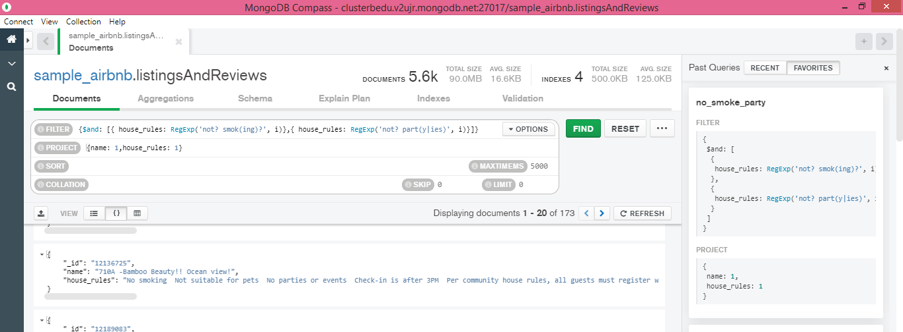

# Sesión5 BEDU:Consultas en MongoDB.
En esta sesión aprendimos principalmente el uso de : **expresiones regulares, operaciones aritméticas y objetos anidados**. 

Para realizar las consultas haremos uso de las ***expresiones regulares*** *(regular expressions)*, estas se basan en la técnica de búsqueda de patrones a partir de una cadena de texto.Para lo cual es necesario : ***/pattern/modifiers*** , donde *pattern* hace referencia a la esrtuctura y *modifiers* como lo indica establece modificadores al patrón (como buscar mayúsculas y minúsculas indistintamente. 

Imagen consultada en: Ultimate Regex Cheat Sheet - KeyCDN Support. (2018, 4 octubre). KeyCDN. https://www.keycdn.com/support/regex-cheatsheet .
Otra liga útil para las regex es: JavaScript RegExp Reference. (s. f.). w3schools.com. Recuperado 20 de noviembre de 2020, de https://www.w3schools.com/jsref/jsref_obj_regexp.asp 
### :pushpin: Reto 1. Expresiones regulares.
Usando la base de datos `sample_airbnblistingsAndReviews`, realiza los siguientes filtros:

- **Propiedades que no permitan fiestas.**
  
- **Propiedades que admitan mascotas.**
  
- **Propiedades que no permitan fumadores.**
  
- **Propiedades que no permitan fiestas ni fumadores.**
  
### :pushpin: Reto 2. Notación punto y arreglos. 
Para las consultas a *objetos anidados* (objetos dentro de objetos) ya sea dentro de un solo campo o dentro de un arreglo hacemos uso de la ***notación punto***. Es importante **delimitar con comillas dobles**, por ejemplo, si queremos proyectar los telefonos de todos los contactos: **{"contacto.telefono" = 1}**, de no delimitarlo con " ", MongoDB aplicará la proyección buscando el campo de nombre : *contacto.telefono* en lugar de aplicar la **notación punto**.Mientras más niveles de anidación de objetos u arreglos hay que incluir más puntos. 

-**Usando la colección `sample_airbnblistingsAndReviews`, agrega un filtro que permita obtener todas las publicaciones que tengan 50 o más comentarios, que la valoración sea mayor o igual a 80, que cuenten con conexión a Internet vía cable y estén ubicada en Brazil.**
**NOTA** En este caso es mejor utilizar el código de país para encontrar la ubicación deseada. 
  
### :pushpin: Reto 3. Introducción a las agregaciones.
Mientras que en SQL teníamos el concepto de subconsultas, MongoDB tenemos el concepto de **agregación**. De tal forma que se introduce el concepto de **Pipeline** la cual es una serie de *stages* o *capas* en donde cada una de ellas recibe como input los datos de capa anterior y en cada paso se genera una nueva colección de datos. Además, en cada capa podemos agregar nuevos campos (**$AddFields**), ordenar colecciones(**$sort**), filtrar datos (**$match**), realizar agrupamientos(**$group**), etc. 

Imagen tomada de: Sharma, V. (2016, 28 octubre). Aggregation in MongoDB. CodeProject. https://www.codeproject.com/Articles/1149682/Aggregation-in-MongoDB
También podemos consultar la documentación de MongoDB https://docs.mongodb.com/manual/core/aggregation-pipeline/. 

- **Usando la colección `sample_airbnblistingsAndReviews`, mediante el uso de agregaciones, encontrar el número de publicaciones que tienen conexión a Internet, sea desde Wifi o desde cable (Ethernet).**

Para este reto hay dos soluciones posibles:

- Ulilizando **$group**.
- Utilizando **$count**.
